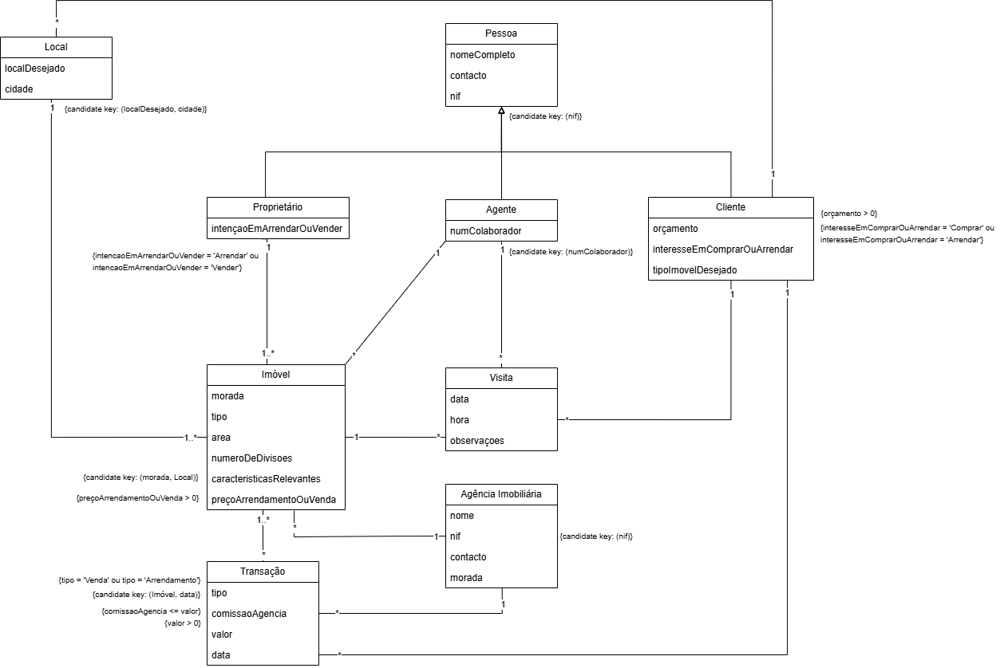

# Real Estate Agency DB

<p align="center">
  
</p>


## Project Description

This project implements the relational database for a **real estate agency**, which intermediates the sale and rental of properties between owners and clients. It covers the people involved (owners, clients and agents), the agencies, the properties and their locations, the visits scheduled for each property, and the sale and rental transactions. The project guidelines are in [`ProjectDescription.md`](./ProjectDescription.md).

The project was developed in two submissions: the [first report](./Relatorio%20Primeira%20Entrega.pdf) covers the domain definition and the conceptual model in UML, and the [final report](./Relatorio%20Final.pdf) covers the refined conceptual model, the relational schema, the functional dependency and normal form analysis, and the use of generative AI at each stage.

This project was developed by myself (up202407610@edu.fe.up.pt), Diogo Caleiro (up202407548@edu.fe.up.pt) and Gonçalo Queirós (up202407377@edu.fe.up.pt) for the Bases de Dados (BD) course unit, FEUP, 2025/26. The work was split evenly across the team, and the main modelling decisions were made together.

> This repository is a personal copy of the group submission.

## Database Overview

- **People**: `Pessoa` (person), specialised into `Proprietario` (owner), `Cliente` (client) and `Agente` (agent).
- **Agencies**: `AgenciaImobiliaria` (real estate agency), which employs the agents.
- **Properties**: `Imovel` (property), owned by an owner, managed by an agent of an agency, and located in a `Local`.
- **Client preferences**: `ClienteLocal`, the locations where each client is looking for a property.
- **Activity**: `Visita` (a client's visit to a property, accompanied by an agent) and `Transacao` (a sale or rental of a property to a client, processed by an agency).

Constraints enforce domain rules such as 9-digit NIFs, positive prices, budgets and areas, valid date and time formats, allowed values for sale/rental types, and an agency commission that never exceeds the transaction value.

## Files

| File | Description |
|---|---|
| `create1.sql` | Initial schema creation, written without generative AI |
| `create2.sql` | Final schema creation (drops, tables, constraints, foreign keys), refined with generative AI |
| `populate1.sql` | Initial sample data |
| `populate2.sql` | Final sample data |
| `ModeloFinal.png` | Final conceptual model (UML) |
| `Relatorio Primeira Entrega.pdf` | First submission report: domain and conceptual model |
| `Relatorio Final.pdf` | Final report: relational schema, normal forms and AI analysis |
| `ProjectDescription.md` | Project guidelines/assignment description |

## Running

```bash
sqlite3 imobiliaria.db < create2.sql
sqlite3 imobiliaria.db < populate2.sql
```
